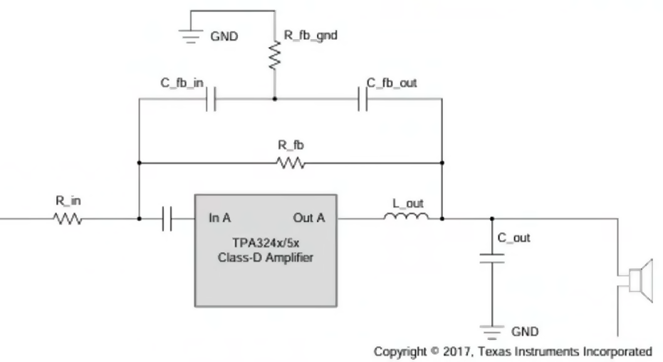

# Финальный расчет трехполосного Tri-amping комплекта (PVDD = 42 B)

Система состоит из 3-х стереоплат (или 6 каналов) на базе TPA324x/5x, подключенных к дифференциальным выходам ЦАП PCM5242 через активный кроссовер. 

*   **Коэффициент усиления для всех полос:** 6 V/V (~15.6 дБ) — для идеального баланса уровней.
*   **Входные конденсаторы на всех платах:** Ваша пленка **2.2 мкФ 63В**.

---

## 1. Сводная таблица номиналов PFFB по полосам частот

| Компонент схемы | 🔊 НЧ-канал (Нагрузка 4 Ом) | 🎙️ СЧ-канал (Нагрузка 8 Ом) | 📐 ВЧ-канал (Нагрузка 8 Ом) |
| :--- | :--- | :--- | :--- |
| **Выходная мощность** | **170 Вт** (THD 1%) / **210 Вт** (max) | **90 Вт** (THD 1%) / **110 Вт** (max) | **90 Вт** (THD 1%) / **110 Вт** (max) |
| **R_in** (входной) | **10 кОм** (1% SMD) | **10 кОм** (0.1% или 1% тонкопленка) | **10 кОм** (1% SMD) |
| **R_fb** (обратная связь)| **30 кОм** (1% SMD) | **30 кОм** (0.1% или 1% тонкопленка) | **30 кОм** (1% SMD) |
| **R_fb_gnd** | **3.9 кОм** | **3.3 кОм** | **3.3 кОм** |
| **C_fb_in / C_fb_out** | **33 пФ** (C0G/NP0) | **27 пФ** (C0G/NP0) | **27 пФ** (C0G/NP0, точные) |
| **Цепь Цобеля на выходе**| Не требуется | Желательно (10 Ом + 0.1 мкФ) | **Строго обязательно** (10 Ом + 0.1 мкФ) |

---

## 2. Важные технические нюансы при сборке по полосам

### 🔊 1. НЧ Усилитель (4 Ом) — Борьба за ток
*   **Дроссели (Красные кольца):** На этой плате они будут греться сильнее всего, так как через них пойдет ток до 9А в пике. Обеспечьте им свободный приток воздуха. Стандартный номинал **10 мкГн** оставляем — PFFB скорректирует АЧХ.
*   **Питание:** Конденсаторы по питанию (PVDD) на этой плате должны быть максимально качественными, с низким ESR (например, Panasonic FR/FC или Nichicon PW), так как именно этот канал будет «просаживать» блок питания на басовых ударах.

### 🎙️ 2. СЧ Усилитель (8 Ом) — Борьба за микродинамику
*   **Качество деталей:** Здесь качество резисторов $R_{in}$ и $R_{fb}$ сильнее всего влияет на сцену и локализацию инструментов. Постарайтесь найти тонкопленочные высокоточные резисторы (например, серии Susumu RR или Vishay Dale). Они практически не имеют теплового шума.
*   **Конденсатор 2.2 мкФ:** На этой плате ваша пленка отработает на 100%. На средних частотах фазовые искажения будут равны нулю, вокал станет осязаемым и «живым».

### 📐 3. ВЧ Усилитель (8 Ом) — Борьба за стабильность
*   **Защита от самовозбуждения:** Твиттеры на высоких частотах представляют собой чисто индуктивную нагрузку. Без параллельной цепочки Цобеля на выходных клеммах (`10 Ом 2Вт резистор + 0.1 мкФ 100В пленочный конденсатор`) глубокая обратная связь PFFB на частотах выше 40 кГц может превратить усилитель в радиопередатчик, что сожжет пищалку. Проверьте, чтобы эта цепь была на плате.
*   **Конденсаторы в петле (27 пФ):** Примените строго диэлектрик **C0G (NP0)**. Обычная дешевая керамика (X7R) меняет свою емкость от нагрева, что приведет к дрейфу фазы на высоких частотах.

---

## 3. Рекомендация по питанию всей системы
Если вы планируете питать все три платы от одного общего мощного блока питания 42 В:
1. Ипользуйте схему подключения **«Звезда»** — провода питания (плюс и земля) к каждой из трех плат должны идти отдельными парами напрямую от клемм блока питания. 
2. Соединять платы последовательно (шлейфом) от одной к другой **категорически запрещено**, иначе басовые токи НЧ-платы создадут помехи на чувствительном СЧ/ВЧ каскаде.

# Фазовые свойства цифровых фильтров в кроссовере на PCM5242

Разделение частот без фазового сдвига реализуется через два типа цифровых фильтров. У каждого свои особенности применения внутри ядра miniDSP микросхем PCM5242.

---

## 1. Типы фильтров: IIR против FIR

### 1. IIR-фильтры (Infinite Impulse Response)
Это цифровой аналог классических катушек, конденсаторов и операционных ОУ (фильтры Баттерворта, Линквица-Райли).
* **Фазовый сдвиг:** Есть. Они крутят фазу точно так же, как аналоговые схемы. Чем круче срез (выше порядок), тем сильнее фазовый сдвиг на частоте раздела.
* **Ресурсы:** Требуют ничтожно мало вычислительной мощности процессора.

### 2. FIR-фильтры (Finite Impulse Response) — Линейно-фазовые
Именно они обеспечивают **нулевой относительный фазовый сдвиг** между полосами частот.
* **Фазовый сдвиг:** Абсолютный 0 градусов относительно друг друга. Музыкальный импульс передается без искажения формы (Time-coherent).
* **Ресурсы:** Требуют огромных вычислительных мощностей. Для качественной фильтрации низких частот (НЧ) требуются тысячи математических коэффициентов (Taps).

---

## 2. Аппаратное ограничение PCM5242 miniDSP

Ядро miniDSP внутри PCM5242 спроектировано как энергоэффективный аудиопроцессор, жестко ограниченный по числу инструкций на один такт частоты дискретизации (обычно около 1024 инструкций при 48 кГц). 

из-за этого ограничения:
1. **НЧ-канал (FIR невозможен):** Для качественного разделения полосы НЧ/СЧ на частотах около 100–300 Гц с помощью линейно-фазового FIR-фильтра микросхеме PCM5242 банально **не хватит вычислительной памяти** (мало Taps).
2. **СЧ/ВЧ-канал (FIR возможен частично):** На высоких частотах разделения (например, стык СЧ и ВЧ на 2.5–4 кГц) длины FIR-фильтра, доступной в PCM5242, может хватить, но это займет почти все ресурсы miniDSP.

---

## 3. Инженерное решение для идеальной фазы на PCM5242

Чтобы получить великолепную фазовую связку без перегрузки чипов PCM5242, в PurePath Studio (PPS) используется классическая хитрость — **конфигурация Линквица-Райли 4-го порядка (LR4)** на базе IIR-блоков:

### Почему это работает:
Фильтры LR4 (спад 24 дБ/октава) на частоте среза крутят фазу НЧ-потока и ВЧ-потока ровно на **360 градусов** (то есть на полный оборот). 
* *Результат:* Фаза на стыке полос оказывается идеально синфазной (360° эквивалентно 0°). Динамики работают абсолютно синхронно, в точке раздела нет провала АЧХ, а динамики не нужно переворачивать по полярности.

### Дополнительный бонус PCM5242:
В среде PurePath Studio вы можете использовать блоки **Delay (задержка сигнала)**. Физически твиттер (ВЧ) обычно расположен ближе к уху слушателя, чем тяжелый диффузор мидбаса (НЧ) из-за глубины корзины динамика. Внутри PCM5242 СЧ и ВЧ каналы можно задержать на несколько микрон (микросекунд), что идеально выровняет акустические центры динамиков по фазе прямо в пространстве вашей комнаты.

# Коррекция фазы для частот среза: 100 Гц и 5000 Гц (в среде ChipStudio)

Обновленные точки раздела:
* **НЧ / СЧ стык:** 100 Гц (Сабвуфер -> Мидбас)
* **СЧ / ВЧ стык:** 5000 Гц (Мидбас -> Твиттер)
* **Тип фильтра в ChipStudio:** Linkwitz-Riley 24 dB/oct (LR4)

---

## 1. Как изменилась физика процесса на частоте 5000 Гц

При переносе раздела с 8000 Гц на 5000 Гц длина звуковой волны увеличилась с 4.2 см до **6.8 сантиметров**. Полуволна теперь составляет **3.4 см**.

* **Влияние на фазу:** Фильтр Линквица-Райли 4-го порядка по-прежнему поворачивает фазу на полные 360 градусов, обеспечивая **0 градусов относительного сдвига** между СЧ и ВЧ платами PCM5242.
* **Пространственное совмещение динамиков:** Поскольку полуволна стала больше (3.4 см), система стала менее критична к микросдвигам динамиков на лицевой панели. Если глубина корзины СЧ-динамика утапливает его примерно на 2–3 см относительно пищалки, то без задержки динамики окажутся в опасной зоне противофазы (звук на стыке провалится).

---

## 2. Настройка временной задержки (Delay) для стыка 5000 Гц

Чтобы компенсировать разницу физического расстояния между магнитами СЧ и ВЧ динамиков до уха слушателя, в ChipStudio используется блок **Delay**:

1. **Канал НЧ (100 Гц):** Задержка `0 мс` (длина волны 3.4 метра, микросдвиги не играют роли).
2. **Канал СЧ (100–5000 Гц):** Задержка `0 мс` (принимается за опорную точку).
3. **Канал ВЧ (5000–20000 Гц):** Выставляется программная задержка для «виртуального отодвигания» твиттера назад.

### Пример экспресс-расчета задержки для ВЧ:
Если СЧ-динамик утоплен глубже твиттера на **2.5 см** (25 мм), расчет времени задержки выглядит так:
$$\text{Задержка (мс)} = \frac{\text{Расстояние (м)}}{\text{Скорость звука (м/с)}} = \frac{0.025}{343} \approx \mathbf{0.073\text{ мс}}$$

Вам достаточно ввести в блоке Delay для ВЧ-канала значение **0.073 мс** (или около **73 микросекунд**), чтобы вернуть акустическую фазу в абсолютный ноль. Звук на стыке полос станет монолитным, а стереопанорама обретет четкую глубину.

---

## 3. Финальные правила конфигурации в ChipStudio (100 Гц / 5000 Гц)

* **Тип спада:** Строго **Linkwitz-Riley 24 dB/oct** для обоих перекрестий.
* **Полярность подключения:** Прямая для всех каналов усилителей TPA324x/5x (+ к +, - к -).
* **Контроль на слух:** Если сцена кажется размытой, плавно меняйте задержку на ВЧ-канале в диапазоне от `0.04 мс` до `0.09 мс`. В точке идеального попадания в фазу вокал четко сфокусируется строго по центру между колонками.

# Руководство по компоновке системы 2.2 в одном корпусе

Состав системы в корпусе: Контроллер управления + 3 модуля PCM5242 + 2 платы TPA324x/5x + АКБ 10S + разъем для БП 42В.

---

## 1. Схема заземления и предотвращение «земляных петель»

В многоканальных системах земляные петли (Ground Loops) — это главная причина фонового гула или писка в динамиках. 

### Правило «Звезды» по питанию (Силовая земля):
* Точкой силовой «Звезды» должна стать **выходная клемма минус (-) аккумулятора (BMS)**.
* От этой ОДНОЙ точки должны идти отдельные пары проводов питания (плюс и минус) на плату НЧ-усилителя и на плату СЧ/ВЧ-усилителя. 
* Соединять питание усилителей последовательно (от одной платы к другой) **категорически запрещено**.

### Сигнальная земля (GND аудио):
* Ваши модули ЦАП PCM5242 от «Чип и Дип» соединены с усилителями балансными (дифференциальными) линиями. В балансном подключении сигнал идет по двум проводам (`+` и `-`), а провод земли (`GND`) выполняет только роль экрана.
* **Рекомендация:** Соединяйте выходы ЦАП со входами усилителей экранированным проводом (две жилы в оплетке). Оплетку (экран) припаивайте к контакту `GND` **только со стороны платы ЦАП**. Со стороны усилителя экран должен быть изолирован и ни к чему не прикасаться. Это полностью разорвет земляную петлю по сигнальному тракту.

---

## 2. Физическое разделение зон внутри корпуса (Экранирование)

Микросхемы TPA324x/5x работают на частоте ШИМ около 450 кГц. Их выходные катушки (красные кольца) являются мощными источниками электромагнитного излучения (антеннами). Чувствительные платы PCM5242 не должны ловить этот эфирный мусор.

* **Зонирование:** Разделите корпус на две виртуальные зоны: «Грязную» (силовую) и «Чистую» (сигнальную).
  * *Грязная зона:* Платы усилителей TPA, силовые провода питания, АКБ и разъем подключения БП.
  * *Чистая зона:* Контроллер управления, три платы PCM5242, шлейфы I2S и I2C.
* **Расстояние:** Между катушками индуктивности усилителей и платами ЦАП должно быть **не менее 5–7 сантиметров** свободного пространства.
* **Корпус:** Сам корпус системы обязательно должен быть **металлическим** (алюминий или сталь) и подключен к силовой земле схемы. Он будет работать как общий экранирующий кокон от внешних радиопомех.

---

## 3. Финальный чек-лист по монтажу деталей PFFB и фильтров

Перед тем как закрыть крышку готового корпуса, убедитесь, что:
1. **Резисторы обратной связи $R_{fb}$ (30 кОм):** Подпаяны жестко и максимально короткими выводами. Помните, что для НЧ-канала (4 Ом) резистор $R_{fb\_gnd}$ равен **3.9 кОм**, а для СЧ/ВЧ (8 Ом) — **3.3 кОм**.
2. **Входные конденсаторы 2.2 мкФ 63В:** Надежно приклеены к плате (термоклеем или герметиком), чтобы от вибраций корпуса они не отломили дорожки.
3. **Защитные RC-фильтры на выходе ЦАП:** (Резисторы 100 Ом + конденсаторы 2.2 нФ) распаяны прямо на выходах плат PCM5242. Они защитят глубокую обратную связь усилителей от ультразвукового мусора.
4. **Цепь Цобеля на СЧ/ВЧ плате:** На выходных клеммах каналов, идущих к Bronze 100, распаяны цепочки `10 Ом + 0.1 мкФ` для стабильности усилителя на ВЧ.
